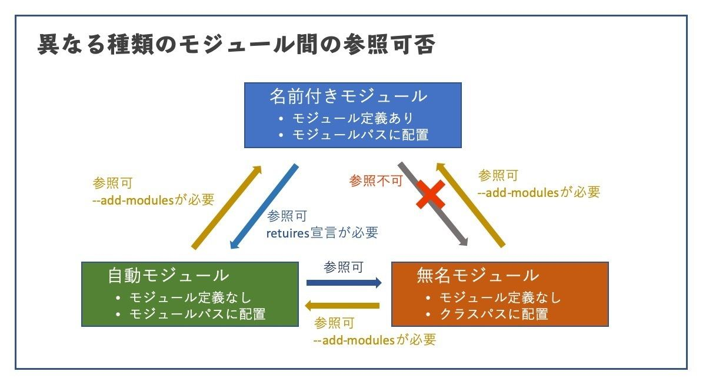

# モジュールシステム

> ecripseで行う方法  
> srcと別にoutファイルを作る（jarファイルを置く用）  
> srcの中にパッケージとクラスを作成。`module-info.java`に公開するパッケージを記載  
> outファイルを除いてエクスポート>jarファイル（outフォルダに配置する）  
> 上記を利用したいプロジェクトのビルドパスの構築＞モジュールパスに上記のjarファイルを設定  
> クラスパスを利用すると無名モジュールとして全公開される。  



## 概要
下記の対策のため
- CLASSPATH上に同名のクラスがあった場合、CLASSPATHは先頭から評価するため、想定外のクラスがロードされてしまう。
- ライブラリ内でのみ呼び出したいpublicクラスが、外部からでも呼び出しが出来てしまう。

## 定義ファイル
- requires  
- transitive　間接エクスポート
- exports どのパッケージを公開するか指定
- provides  
- with  
- uses  
- opens 

module-info.javaの設定例
※関節エクスポートされていてもモジュールパスを指定する必要がある。
```java
//module_main/module-info.java
module module_main {
	requires module_sub;
}

//module_sub/module-info.java
module module_sub {
	exports module_sub.main;
	requires transitive module_3rd;
}

//module_3rd/module-info.java
module module_3rd {
	exports module_3rd.main;
}
```


- すべてのモジュール宣言で「requires java.base;」が暗黙的に行われているので省略できる。

javac、javaコマンドのモジュールに関するオプション

|オプション|説明|
|---|---|
|--module-path（または、-p）|アプリケーション・モジュールを検索する位置を指定|
|--module（または、-m）|モジュール名とエントリ・ポイントとなるクラス（mainクラス）を指定|
|-d <クラスファイルの生成場所> <コンパイル対象のソースファイル>|クラスファイルの生成場所を指定|

## 名前付きモジュールとその他のモジュール

無名モジュール（Unnamed Module）
- すべてのパッケージをexportsする
- モジュールパス上のすべてのモジュールをrequiresする
- 名前付きモジュールから無名モジュールを参照することは出来ない.

自動モジュール（Automatic Module）
- すべてのパッケージをexportsする
- モジュールパス上のすべてのモジュールをrequiresする
- 名前付きモジュールから自動モジュールの参照が可能。

【1】マニフェストファイル（MANIFEST.MF）のAutomatic-Module-Name属性の値
【1】マニフェストファイル（MANIFEST.MF）で指定されていない場合は、JARファイル名で解決

### モジュールの依存性の確認

|オプション|説明|
|---|---|
|--describe-module（または、-d）|モジュール記述子の情報を出力|
|--show-module-resolution|モジュールの解決の様子を出力|

### jdepsコマンド
jdepsコマンドは、クラスファイルの依存関係をパッケージまたはクラスレベルで表示します。
>DOTファイルは、プレーンテキストを用いてデータ構造を表現するファイルです。ツールを使用して、DOTファイルをPNGファイルなどに変換することが可能です。

|オプション|説明|
|---|---|
|-summary（または、-s）|依存関係のサマリーのみを出力|
|-jdkinternals|JDK内部APIでクラス・レベルの依存関係を検索|
|-dotorutput|DOTファイルの出力先ディレクトリを指定。\<archive-file-name>.dotという名前のファイルと、アーカイブ間の依存関係を一覧表示したsummary.dotという名前のサマリーファイルを生成|


## カスタムランタイム・イメージの作成（jlinkコマンド）
単体で入手できるのはJDKのみ。


|オプション|説明|
|---|---|
|--add-modules|イメージに追加するモジュールを指定|
|--module-path（または、-p）|モジュール・パスを指定|
|--compress（または、-c）||
|--launcher command=module|モジュールのランチャー・コマンド名、またはモジュールおよびメイン・クラスのコマンド名|
|--output|出力ディレクトリ|

## ServiceLoaderとモジュール・システム
指定したインターフェースの実装クラスを動的にロードするための仕組み。

### モジュール・システムでのServiceLoaderの利用
```java
provides <サービス> with <サービスプロバイダ>;
```

## ボトムアップ移行とトップダウン移行
## モジュール定義ファイルとモジュールに関するコマンドのまとめ

モジュールに関連する各コマンド（およびオプション）

||||
|---|---|---|
|java,javac |--module-path（または、-p）      |アプリケーション・モジュールを検索する位置を指定|
|           |--module（または、-m）           |モジュール名とエントリ・ポイントとなるクラス（mainクラス）を指定|
|java       |--list-modules                   |参照可能なモジュールを出力|
|           |--describe-module（または、-d）  |モジュール記述子の情報を出力|
|           |--show-module-resolution         |モジュールの解決の様子を出力|
|jdeps      |-summary（または、-s）            |依存関係のサマリーのみを出力|
|           |-jdkinternals                    |JDKの内部APIでクラス・レベルの依存関係を検索|
|           |-dotoutput                       ||
|           |--module-path（または、-p）        |モジュール・パスを指定|
|jlink      |--add-modules                    |イメージに追加するモジュールを指定|
|           |--module-path（または、-p）        |モジュール・パスを指定|
|           |--compress（または、-c）           ||
|           |--launcher command=module（または、--launcher command=module/main）||
|           |--output                           |出力ディレクトリ|
